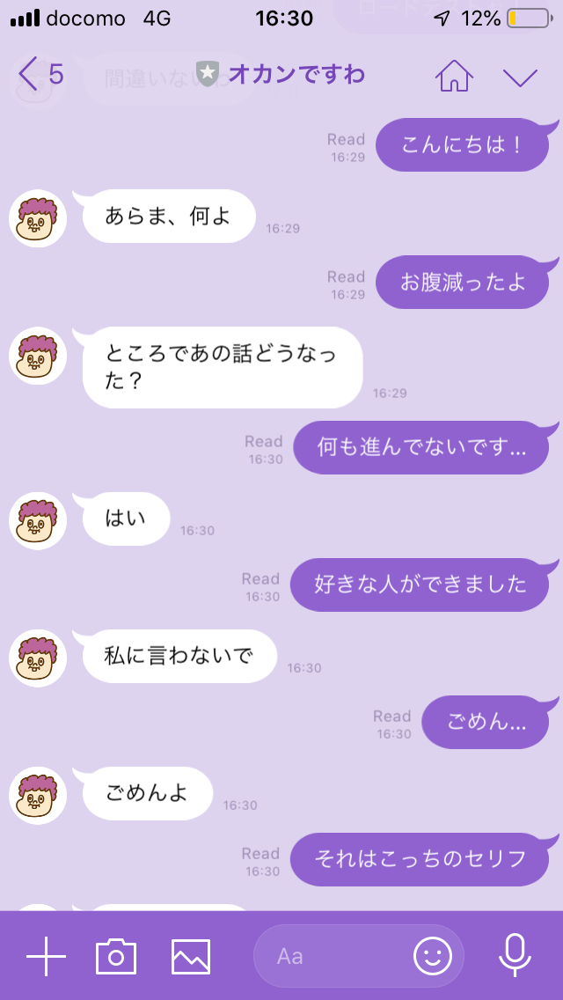
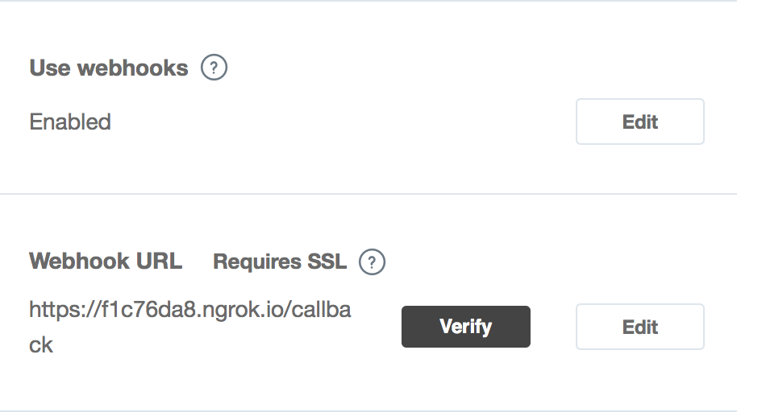

/csvにある、dataset_okan.csvをもとに学習させ、phrases_okan.csvでセリフを与えた場合の例：

# とりあえず動かす
## 環境構築
1. Python3で書かれています。`pip3 install -r requirements.txt`で、必要なパッケージをインストールしてください。
1. また、サーバーを立てるためにngrokというサービスを使用します。[ngrokのサイトからインストール](https://ngrok.com/download)してください。

## LINEのアカウント登録
1. [LINE messaging API](https://developers.line.me/en/services/messaging-api/)のアカウントを作ってください。作ったアカウントの、Channel secretとChannel access tokenを記録しておいてください。また、「Webhookを使用」をオンにしておいてください。
1. チャットボットのプログラムが、LINEと認証できるように、レポジトリのトップディレクトリにcredentials.xmlというテキストファイルを作成し、以下のようにchannel secretとchannel access tokenをコピペしてください。
```xml
<!-- credentials.xml -->
<data>
  <token> *channel access token* </token>
  <secret> *channel secret" </secret>
</data>
```

## 実行
1. `python3 bot.py`で、チャットボットのプログラムを起動します
1. 別ターミナルで、`ngrok http 5000`で、サーバーを立ち上げます。
1. ngrokの実行画面で、*???.ngrok.io*のようなURLが表示されるはずです。これを、先ほどのLINEの設定画面のWebhook URLに、末尾に/callbackをつけてコピペします。


# 自分で用意したデータセットで学習させる
作成中…

# 仕組み
## 再帰型ニューラルネットワーク(RNN)
TensorFlowのRNNモジュールを使用しています。
普通のニューラルネットワークだと、毎回同じサイズのデータしか扱えないため、会話文のような、長さが事前に分からないデータには適していません。
一方でRNN（再帰型ニューラルネットワーク）は、どんな長さのデータでも学習できるので、機械翻訳やチャットボットなどに多く用いられています。
